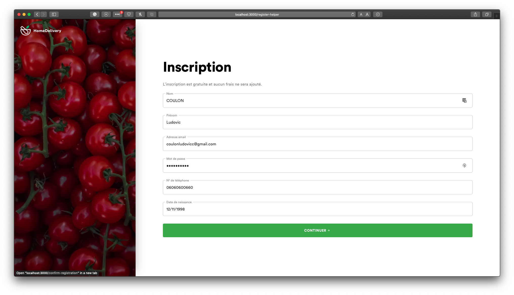

# Inscription 🍃

## Choisir un camp lors de votre inscription

* Créer un compte dit "**classique**" 👩‍💼
* Ou alors créer un compte "**bénévole**" 👨‍👨‍👦‍👦

## Le compte classique 👩‍💼 

Il vous permet de créer des annonces sur notre plateforme, être aider par la communauté de HomeDelivery.

## Le compte bénévole 👨‍👨‍👦‍👦 

Aidez les personnes dans le besoin, rejoignez la communauté de bénévole. Vous allez directement être en relation avec les habitants qui en ont le plus besoin en répondant à des annonces et remplir une liste de tâche.

## Comment faire ce choix ? 🙄

Rendez-vous sur la page de création de compte et choisissez votre camp

## Inscription avec un compte classique 👩‍💼

Vous devez alors simplement remplir les champs demandés pour créer votre compte, si vous vous êtes trompé sur un champ, pas de panique vous pouvez changer vos informations de compte dans votre espace personnel.

## Inscription avec un compte bénévole 👨‍👨‍👦‍👦

Comme pour le compte classique veuillez remplir les champs demandés pour créer votre compte utilisateur.

## Confirmation d'inscription ✅

Pour les deux types de compte \(classique et bénévole\) vous allez recevoir sur votre email que vous avez renseigné à l'inscription un mail de confirmation il suffit de copier le code et de le coller.

